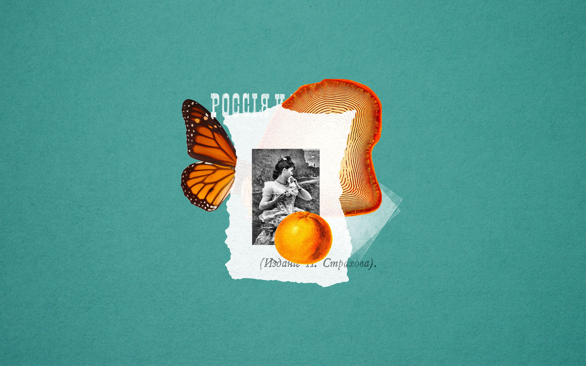
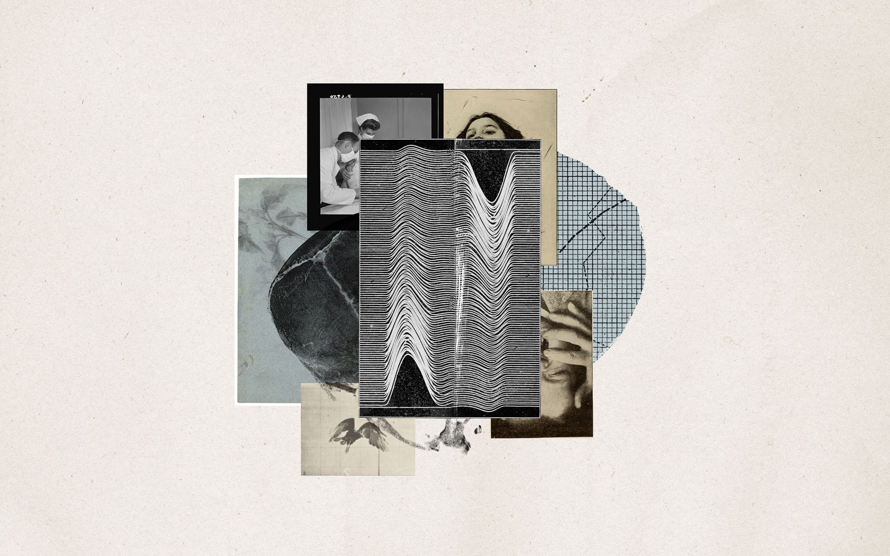

    

        
    

    

        
    

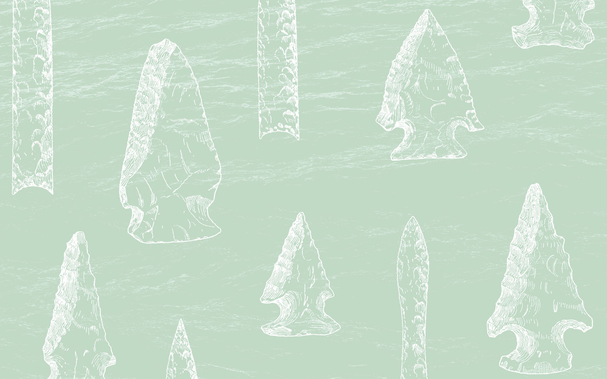

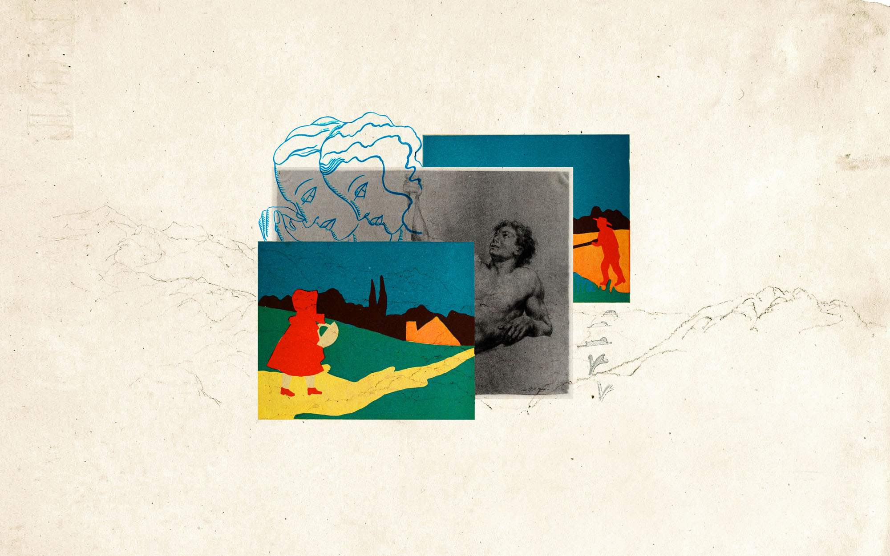
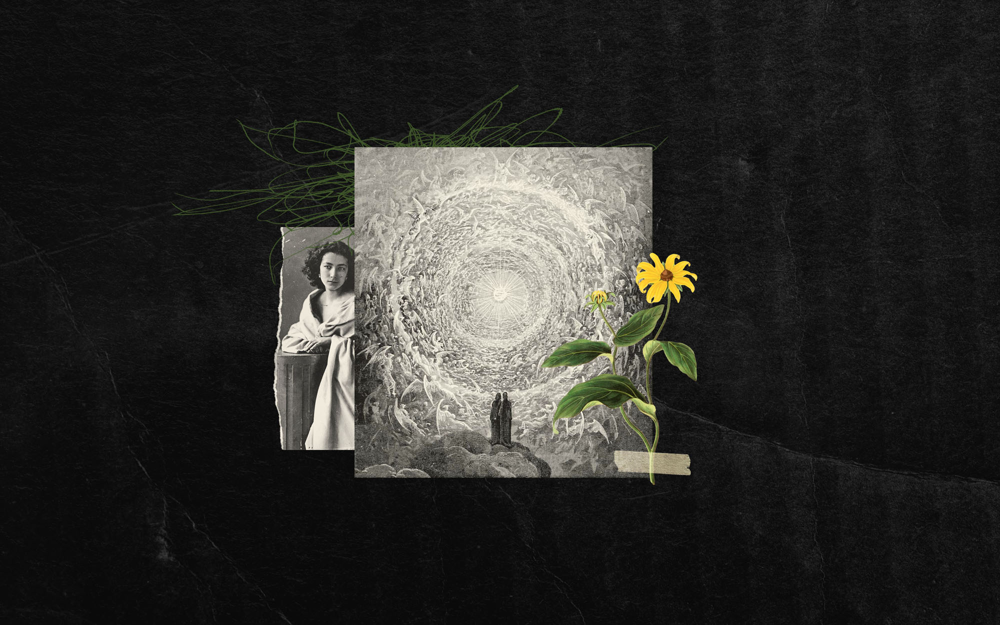

    

        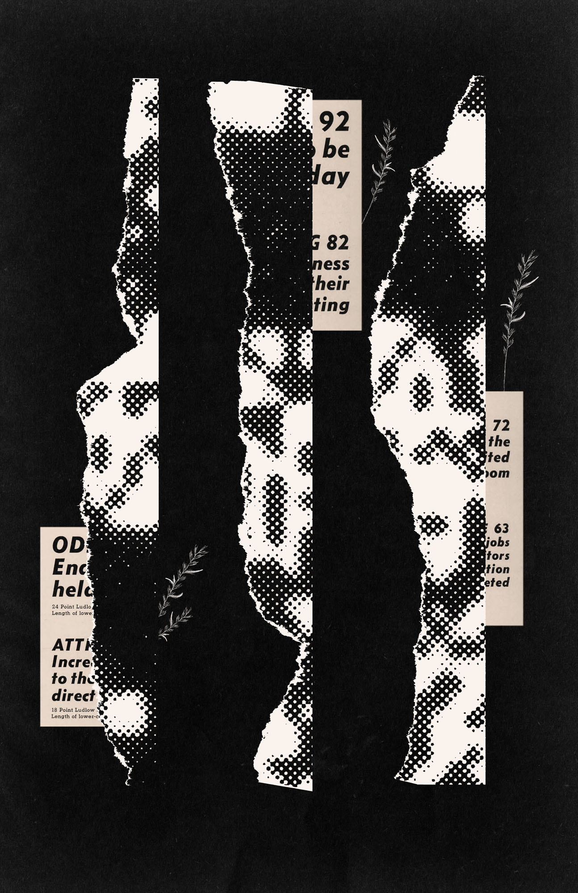
    

    

        
    

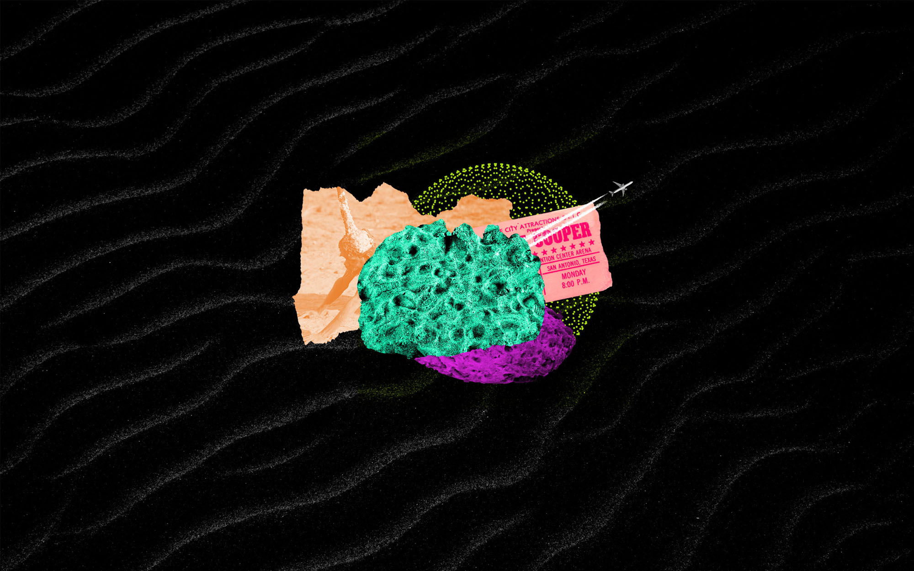
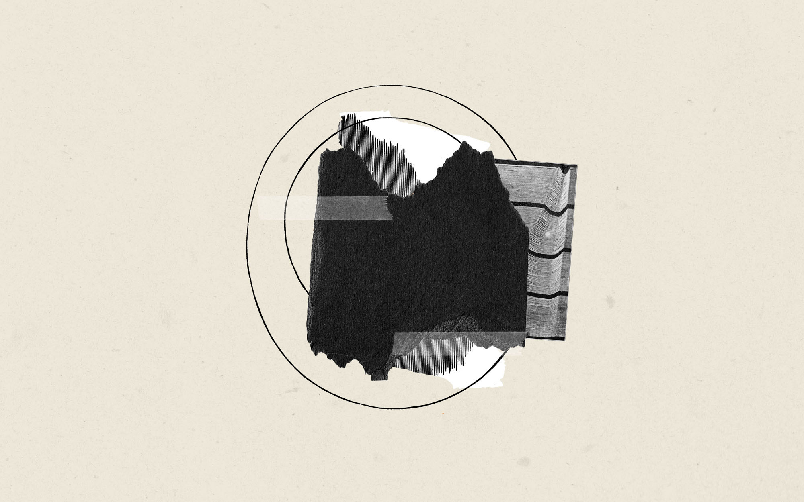
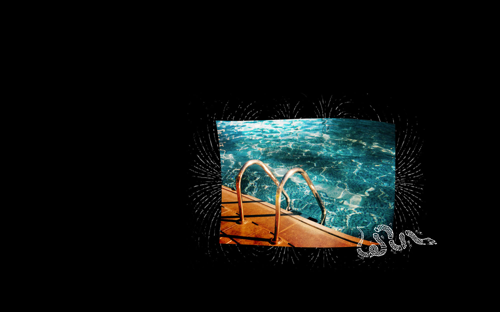

    

        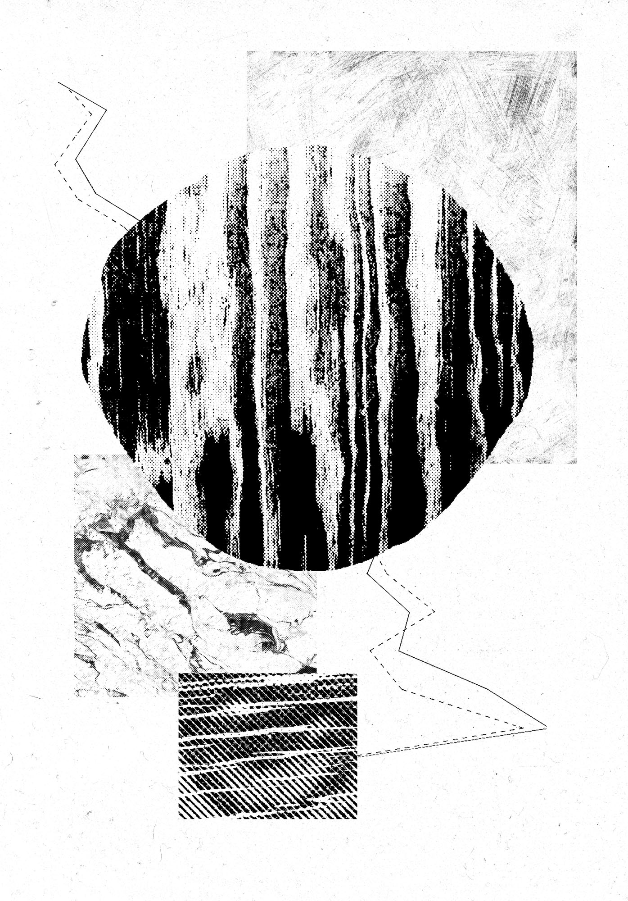
    

    

        
    

    

        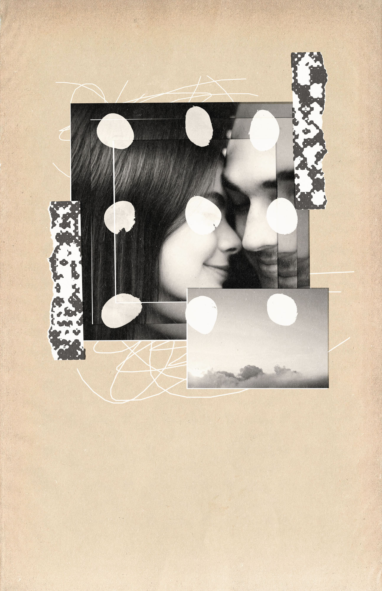
    

    

        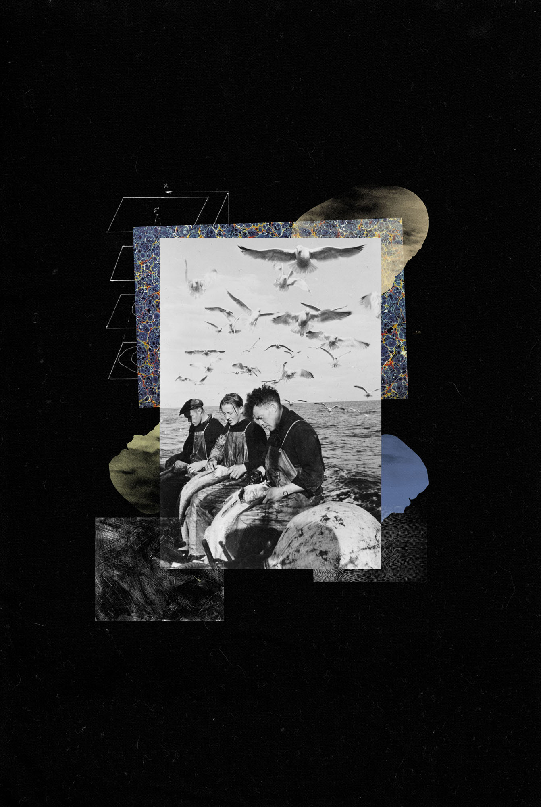
    

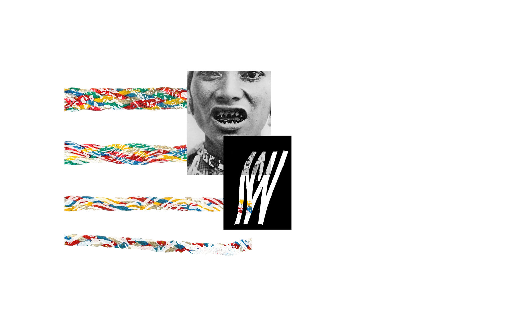

`video: ./images/electricbox.mp4`
