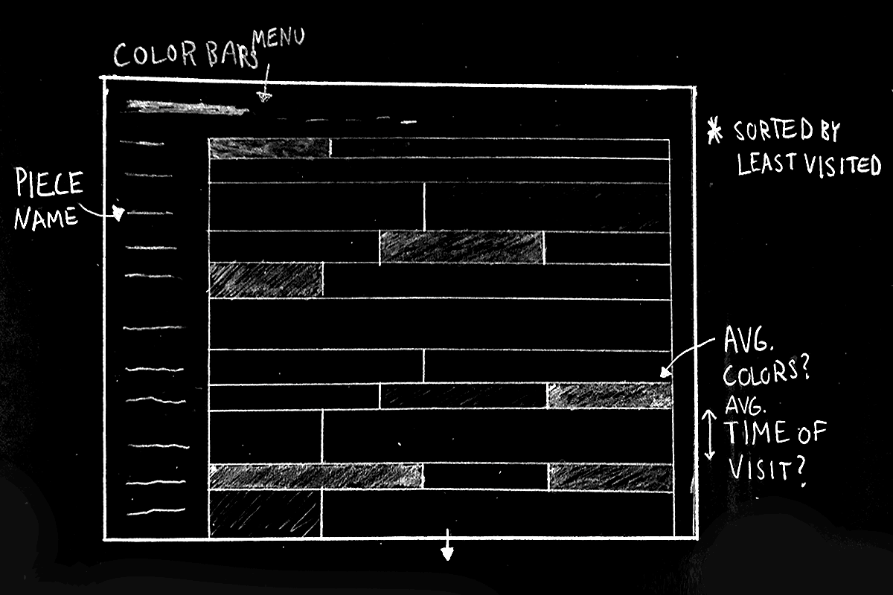
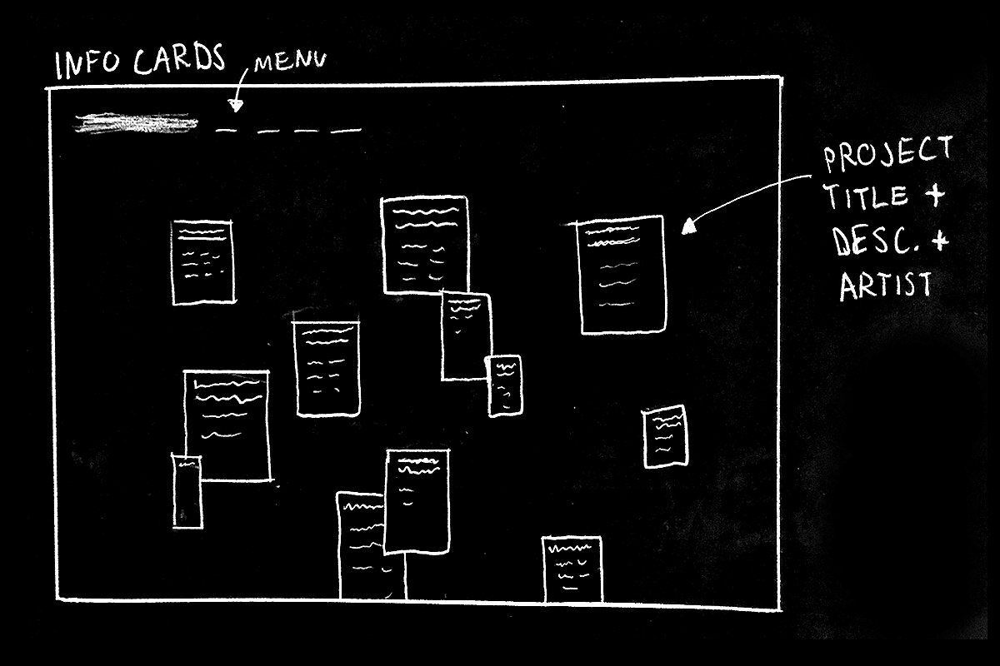
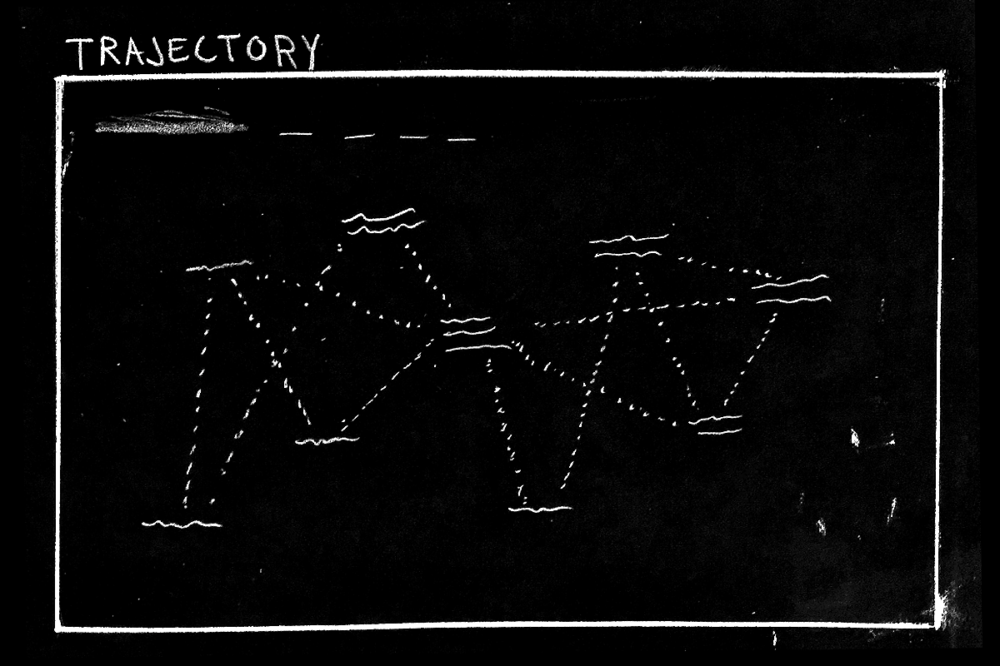
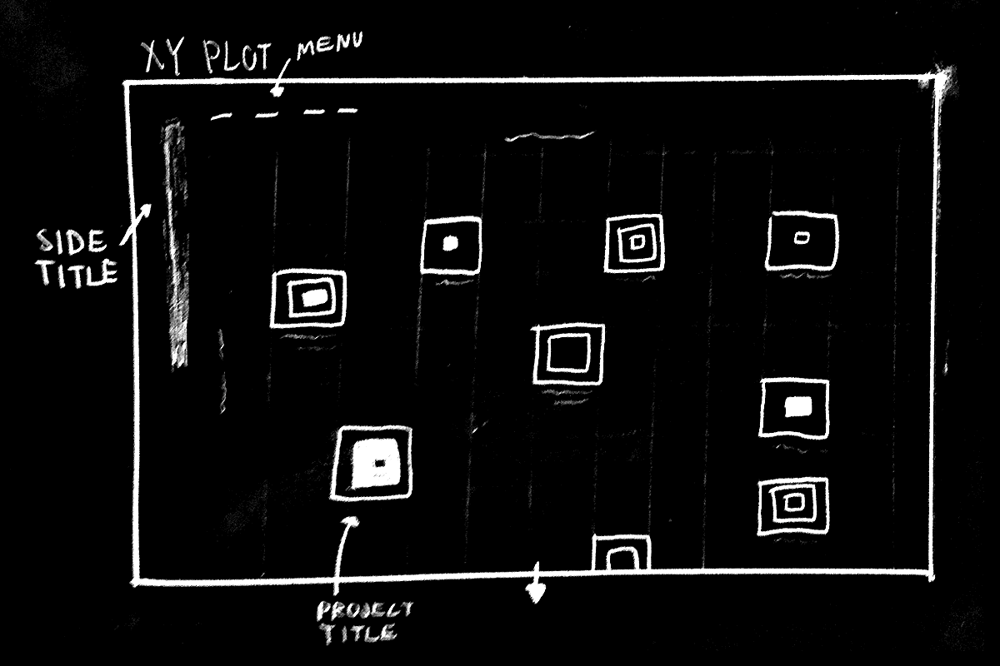
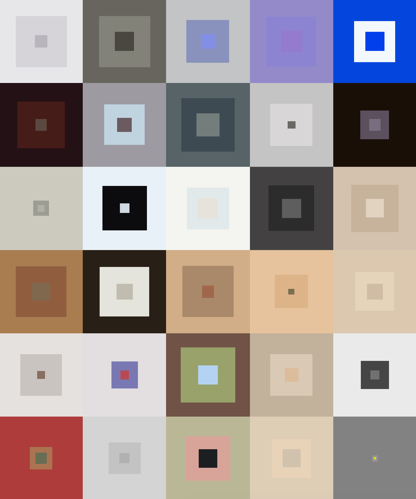
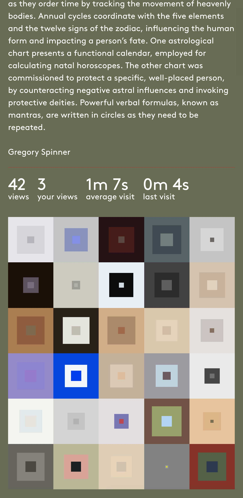
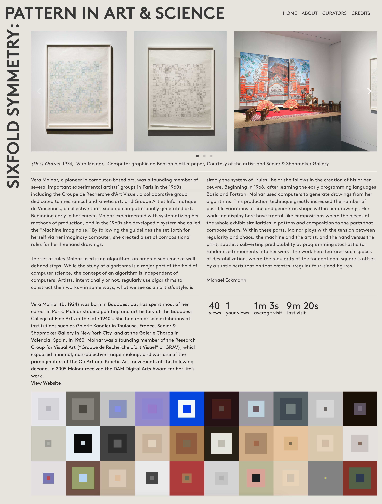
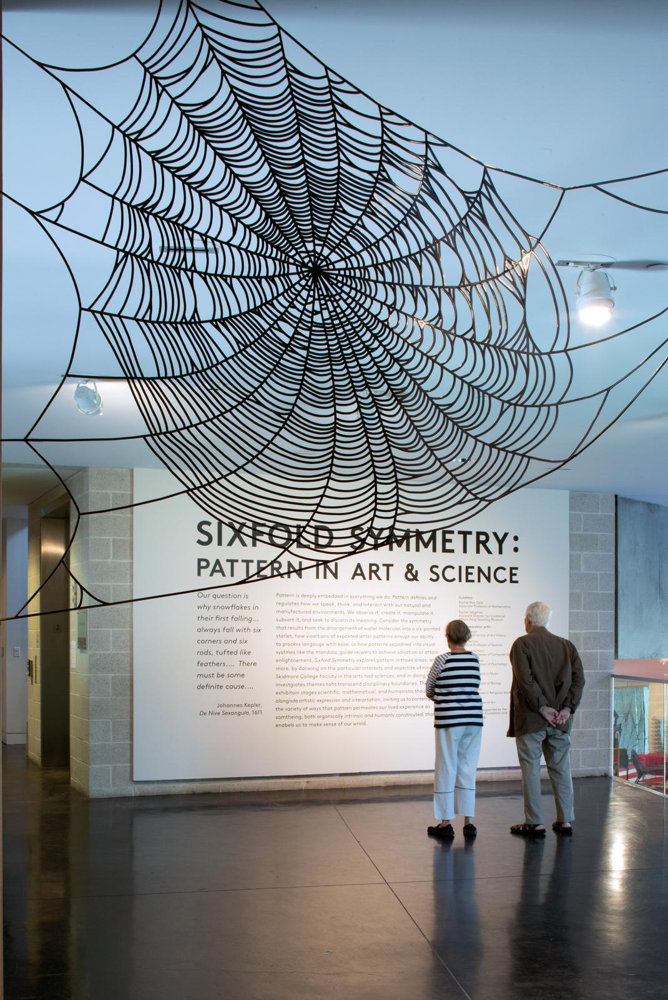
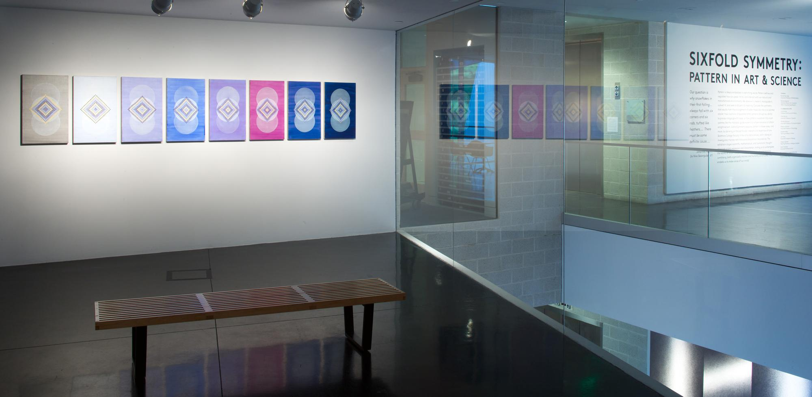
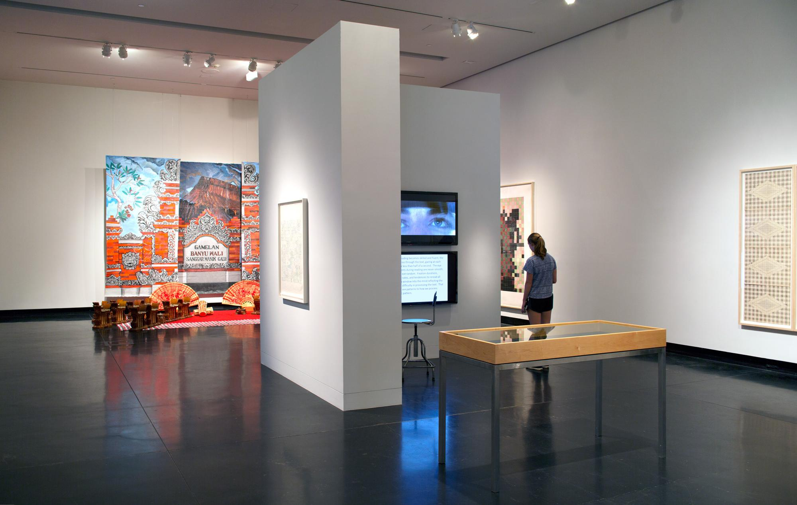

## Process
From the time of conception it was clear that the site's layout should both influence and be influenced by the patterns of user interaction. Basic patterns to track were easily identifiable: number of visits, duration of visit, time since last visit. Determining the way the site could display these patterns was the first obstacle to overcome.

Most options felt too structured, reminiscent of graphs and infographics. Others too organic. Ultimately, we decided that squares scattered, rather than fixed on a grid, felt like a natural balance between the two."

## Colors
"Each item in the exhibition had to be analyzed using a single point of measurement. As an interdisciplinary exhibition, with pieces composed from a wide variety of mediums, color was one of the few factors that could be measured equally. I wrote a script that extracted the three most common colors of an image and their percentage of the photo. The script was then run on a photo of each exhibition item and the results used to create CSS styles for each piece.

## Stats

Statistics are tracked in MongoDB for each item using the following techniques:

Views: With each GET request for an item's content, the view count is increased.

Your Views: Each visit to an item's page increases a locally stored cookie on the user's browser.

Average Visit: The duration of each page visit is tracked per user. On unload or page change, the visit duration is POSTed to the server's API.

Last Visit: On each GET request for an item's content, a timestamp is recorded. On any subsequent visit, the is computed and displayed.

## The Exhibition

